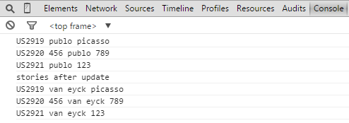

Update Names Of Stories
=========================

## Overview
This app searches for stories where name contains one string and replaces this string with another string. The rest of the name is not changed, only a part that matches the query.
Here is a screenshot from Chrome's DevTools showing the outcome:

This app is available on AS IS basis. It is not supported by Rally support.

## License

AppTemplate is released under the MIT license.  See the file [LICENSE](./LICENSE) for the full text.

##Documentation for SDK

You can find the documentation on our help [site.](https://help.rallydev.com/apps/2.0rc3/doc/)
